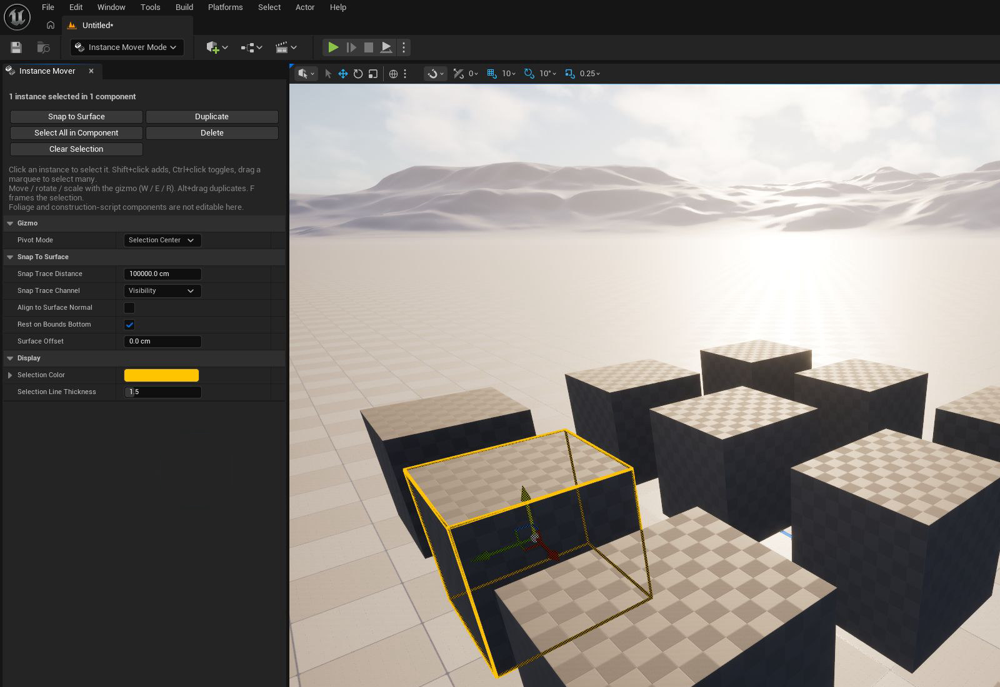

# Instance Mover

Instance Mover is an Unreal Engine editor mode for selecting **individual instances** of Instanced Static Mesh (ISM)
and Hierarchical Instanced Static Mesh (HISM) components in the level viewport. Move, rotate, scale, duplicate, delete,
or snap them to a surface with the familiar viewport controls.

Editor-only: one `Editor` module, no runtime code, nothing cooked.

## Install

1. Copy this folder to `YourProject/Plugins/InstanceMover/`, so the project contains
   `YourProject/Plugins/InstanceMover/InstanceMover.uplugin`.
2. Open the project in Unreal Editor and build the plugin if prompted. If it is disabled, enable **Instance Mover**
   under **Edit → Plugins** and restart the editor.

## Quick start

*Instance Mover in Unreal Editor 5.7. One cube instance is selected; the other cubes belong to the same ISM component.*

1. Open a level that contains an actor with an ISM or HISM component and at least one instance. A component added in a
   Blueprint's Components panel works; a component created by a construction script cannot be edited in this mode.
2. In the level editor toolbar, open **Modes → Instance Mover**.
3. Click one instance in the viewport. An orange wire box shows the selected instance, and the transform gizmo appears
   at the selection pivot.
4. Drag the gizmo to move it. Use **W**, **E**, or **R** to switch between move, rotate, and scale. Optionally click
   **Snap to Surface** in the Instance Mover panel to drop it onto the surface below.

If a click selects the owning actor instead, see [How picking works](#how-picking-works).

## Controls

These controls work while **Instance Mover** is active:

| Action | Input |
|---|---|
| Select an instance | Click it |
| Add to selection | Shift + click, or Shift + marquee |
| Toggle in selection | Ctrl + click |
| Select many | Marquee drag (instance *location* must be inside) |
| Move / rotate / scale | Gizmo — W / E / R, world/local space, grid snapping all work as for actors |
| Duplicate and move | Alt + drag the gizmo |
| Duplicate in place | Ctrl + D, or **Duplicate** in the panel |
| Delete | Delete, or **Delete** in the panel |
| Frame selection | F |
| Clear selection | Esc |

Panel buttons: **Snap to Surface**, **Duplicate**, **Select All in Component**, **Delete**, **Clear Selection**.

Every operation is a single undo step; a whole gizmo drag is one transaction however many frames it spans.

Clicking anything that is not an editable instance falls through to normal actor selection, and selecting an actor
hands the gizmo back to it — so you can stay in the mode while still moving ordinary actors.

## How picking works

1. If the component has **`bHasPerInstanceHitProxies`** on (Details → Rendering → Advanced), the click is pixel-exact.
2. Otherwise a collision trace is tried — ISM traces report the exact instance hit.
3. Otherwise the nearest instance whose **mesh bounds** the click ray crosses wins. This keeps components with
   collision disabled pickable, but on overlapping, irregular meshes (trees, bushes) it can choose a neighbour —
   turn on per-instance hit proxies on that component for exact picking.

## Snap to Surface

Traces straight down from the top of each instance's bounds on `SnapTraceChannel`, ignoring the instance's own
component (a trace cannot exclude a single instance, so instances of one component cannot be stacked on each other
this way). Options: align to surface normal, rest the bounds bottom (vs. the pivot) on the surface, extra offset.

## Not editable here (by design)

- **Foliage** instances — Foliage mode owns them and keeps its own spatial data.
- Components created by a Blueprint **construction script** — the script rebuilds them, so a move would be lost
  the next time it reruns. Components added in the Blueprint's component list are fine.
- Actors with **Lock Location** set, and actors in **locked levels**.
- Procedurally regenerated ISMs (e.g. PCG output) are editable but will be overwritten when regenerated.

## Settings

Per-user (`config=EditorPerProjectUserSettings`, saved under `Saved/Config`) and shown in the mode panel. Defaults
live in the `UInstanceMoverSettings` constructor:

| Setting | Default |
|---|---|
| Pivot Mode | Selection Center |
| Snap Trace Distance | 100000 cm |
| Snap Trace Channel | Visibility |
| Align to Surface Normal | off |
| Rest on Bounds Bottom | on |
| Surface Offset | 0 cm |
| Selection Color / Line Thickness | orange / 1.5 |

## Tests

`Source/InstanceMover/Private/Tests/InstanceMoverTest.cpp` — gizmo delta math, ray picking, surface snap, selection
bookkeeping — registered under `PetwallParade.InstanceMover.*` for Unreal's automation test runner.
